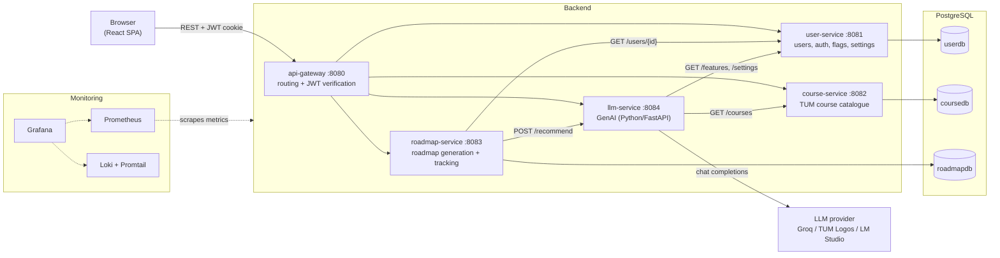

# Architecture

High-level architecture description of TUMgoal: decomposition into subsystems,
their responsibilities, and the interfaces between them.

Related documents:
- [Database schema](system_overview/database_schema.md) (ER diagrams per database)
- [Monitoring guide](MONITORING.md) (dashboards, alerts, log pipeline)
- [OpenAPI specifications](../api/) (per-service API contracts)
- [README](../README.md) (setup and deployment instructions)

## 1. High-Level Overview

TUMgoal turns a student's academic or career goal into a structured learning
roadmap: milestones with tasks, TUM course recommendations, and progress
tracking. The system is a microservice-based client-server application: a React
single-page app talks REST to an API gateway, which routes to three Spring Boot
microservices and one Python GenAI service. Each Spring Boot service owns its own
PostgreSQL database; the GenAI service calls an external (or local) large
language model to generate the roadmap content.

## 2. Subsystem Decomposition

| Subsystem | Technology | Port | Owns |
|---|---|---|---|
| Client | React 19 + TypeScript + Vite, served by nginx | 3000 | UI: goal input, roadmap view, login/signup, admin panel |
| API Gateway | Spring Boot | 8080 | Routing, JWT verification, role enforcement, identity header injection |
| User Service | Spring Boot | 8081 | `userdb`: accounts, roles, auth (JWT issuing), feature flags, runtime settings |
| Course Service | Spring Boot | 8082 | `coursedb`: TUM course catalogue (source of truth) |
| Roadmap Service | Spring Boot | 8083 | `roadmapdb`: goals, roadmaps, milestones, tasks, progress |
| LLM Service (GenAI) | Python + FastAPI | 8084 | Roadmap generation via LLM providers, token quota, no database |
| Persistence | PostgreSQL 16 | 5432 | Three databases on one instance; primary + streaming replica on AET |
| Monitoring | Prometheus, Grafana, Loki, Promtail | — | Metrics, dashboards, alert rules, log aggregation |

### 2.1 Client (React)

Single-page application (React 19, TypeScript, Vite; nginx serves the production
build). All data access goes through the API gateway over REST — the client never
talks to a microservice directly. Key views: goal input and roadmap chat, roadmap
progress view, login/signup, and an admin panel where admins manage feature
flags and runtime settings and can jump to Grafana (via the `grafanaLink`
feature flag).

### 2.2 API Gateway

Single entry point for the client. Two responsibilities:

1. **Authentication and authorization** (`JwtAuthFilter`): public paths
   (`/auth/login`, `/auth/signup`, `/actuator/**`) pass through; every other
   request must carry a valid JWT in the `token` cookie, otherwise 401.
   Admin-only paths (`/users/**`, `/auth/logs`, `/llm/logs`, and `PUT` on
   `/features/**` and `/settings/**`) additionally require the `ADMIN` role,
   otherwise 403.
2. **Routing with identity injection** (`GatewayController`): forwards requests
   to the owning service. Client-supplied `X-User-Id`/`X-User-Role` headers are
   stripped and replaced with values derived from the *verified* JWT, so a
   caller can never spoof another user's identity. Downstream services trust
   these headers and contain no JWT logic themselves.

### 2.3 User Service

Owns identity and runtime configuration:

- **Accounts and auth**: signup/login with BCrypt-hashed passwords; issues
  HS256-signed JWTs (24h expiry) using the shared `JWT_SIGNING_KEY`; the
  gateway verifies them. Roles: `USER`, `ADMIN`. An admin account can be
  bootstrapped at startup from `ADMIN_EMAIL`/`ADMIN_PASSWORD`.
- **Feature flags** (`/features`): runtime toggles stored in `userdb`, editable
  from the admin panel without redeploy (e.g. `llmUseLogos` switches the LLM
  provider at runtime).
- **Runtime settings** (`/settings`): editable text settings such as prompt
  sections and the monthly token limit, consumed by the llm-service.
- **Auth observability**: in-memory auth event log (`/auth/logs`, admin-only)
  and Prometheus metrics for logins, signups, and gateway rejections.

### 2.4 Course Service

Read-only REST facade over the TUM course catalogue (`coursedb`) — the system's
source of truth for university courses. Populated by a separate seeder
(`fetch_and_seed_courses.py`, packaged as its own image and run as a Kubernetes
job / compose one-shot service) that writes to the database directly.

### 2.5 Roadmap Service

Coordinates roadmap generation and tracks progress. On
`POST /roadmaps/generate` it validates the user against user-service
(`GET /users/{id}` — the id comes from the gateway-injected `X-User-Id`), calls
the llm-service (`POST /recommend`), and persists the returned roadmap as
goal → roadmap → milestones → tasks (see the
[database schema](system_overview/database_schema.md)). Task completion toggles
recompute milestone status and roadmap progress.

### 2.6 LLM Service (GenAI)

Independent Python/FastAPI microservice owning all AI logic:

- **Provider abstraction** — three interchangeable chat-completion providers:
  TUM-hosted **Logos** (`openai/gpt-oss-120b`), **Groq** cloud
  (`llama-3.3-70b-versatile`), and a **local LM Studio** server (no cloud
  dependency). The provider is picked *per request*: Logos when its key is set
  and the `llmUseLogos` flag is on, else Groq, else the local model — so the
  system demonstrably works with both remote and local inference.
- **Context building** — fetches the course catalogue from course-service and
  narrows it with TF-IDF to the top-K most goal-relevant courses before
  prompting, so recommendations reference real TUM courses.
- **Runtime configuration** — reads feature flags and prompt/limit settings from
  user-service (cached 30s), letting admins tune behaviour without redeploys.
- **Token quota** — per-user monthly token budget (in-memory, default 50k,
  admin-configurable); requests over budget are rejected with a quota error.
- **Observability** — Prometheus metrics for request outcomes
  (success / parse_error / provider_error / quota_exceeded), per-provider
  latency, and token consumption; visualised in the *LLM Service* Grafana
  dashboard.

It keeps no database; its only state is the in-memory quota counter.

### 2.7 Persistence

PostgreSQL 16. One instance hosts `userdb`, `coursedb`, and `roadmapdb`
(created by `server/init-databases.sql` locally, or the chart's init config on
Kubernetes); table schemas are auto-created by JPA from the entity classes. On
the AET cluster postgres runs highly available as `postgres-0` (primary) +
`postgres-1` (streaming replica). Full schema:
[database_schema.md](system_overview/database_schema.md).

### 2.8 Monitoring

Prometheus scrapes every service's metrics endpoint (15s interval) and evaluates
the alert rules (`ServiceDown`, `HighErrorRate`, `HighLatency`); Grafana ships
five provisioned dashboards; Promtail tails container logs into Loki. Deployed
identically by Docker Compose and the Helm chart. Details:
[MONITORING.md](MONITORING.md).

## 3. Interfaces

### 3.1 Client ↔ Gateway (external REST API)

The only interface exposed to browsers. JWT travels in an HTTP-only `token`
cookie set by `POST /auth/login`.

| Route | Forwarded to | Access |
|---|---|---|
| `/auth/**` | user-service | `login`/`signup` public; `me`/`logout` signed-in; `logs` admin |
| `/users/**` | user-service | admin |
| `/courses/**` | course-service | signed-in |
| `/roadmaps/**` | roadmap-service | signed-in (own roadmaps); `/roadmaps/all` admin |
| `/features/**` | user-service | GET signed-in; PUT admin |
| `/settings/**` | user-service | GET signed-in; PUT admin |
| `/llm/**` | llm-service (prefix stripped) | signed-in; `/llm/logs` admin |

Per-service API contracts live in [`api/`](../api/) (OpenAPI), browsable via
Swagger UI (see the README's API Documentation section).

### 3.2 Service-to-service (internal REST)

| Consumer | Provider | Endpoint(s) | Purpose |
|---|---|---|---|
| roadmap-service | user-service | `GET /users/{id}` | Validate the requesting user exists |
| roadmap-service | llm-service | `POST /recommend` | Generate roadmap content for a goal |
| llm-service | course-service | `GET /courses` | Fetch catalogue for TF-IDF course matching |
| llm-service | user-service | `GET /features`, `GET /settings` | Runtime flags, prompt sections, token limit |
| course-seeder | coursedb (SQL) | direct insert | One-shot catalogue population |

Identity propagates through the `X-User-Id`/`X-User-Role` headers injected by
the gateway; internal calls between services do not re-verify JWTs.

### 3.3 External interfaces

| Interface | Direction | Notes |
|---|---|---|
| Groq / Logos chat-completions API | llm-service → cloud | HTTPS; keys injected as secrets, never committed |
| LM Studio (local model) | llm-service → host | Optional no-cloud fallback (`LLM_API_URL`) |
| Prometheus scraping | Prometheus → all services | Spring Actuator / FastAPI metrics endpoints |
| Ingress (AET) / Traefik (Azure VM) | internet → client + gateway | TLS termination; Grafana exposed at `/grafana` on AET |

### 3.4 Service discovery and configuration

No hardcoded hosts or ports: service hostnames and ports are injected as
environment variables — centralised in `infra/docker-compose.yml` (compose) and
`helm/team-devvopps/values.yaml` (Kubernetes) — and resolved by Docker's or the
cluster's DNS. Secrets (database credentials, JWT signing key, provider API
keys, Grafana admin login) are externalised via `infra/.env` locally and GitHub
Secrets → Helm `--set` on the clusters; deployments fail fast when a required
secret is missing rather than falling back to defaults.

## 4. Diagrams

- Subsystem decomposition: section 1 above (Mermaid) and
  `system_overview/diagrams/system_architecture.png`
- Database ER diagrams: [database_schema.md](system_overview/database_schema.md)

> **TODO:** Add the remaining mandatory UML diagrams — a Use Case Diagram and an
> Analysis Object Model — and, if required by the tutors, a formal UML version of
> the subsystem decomposition.
