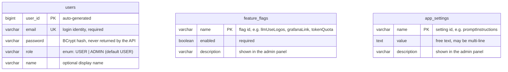
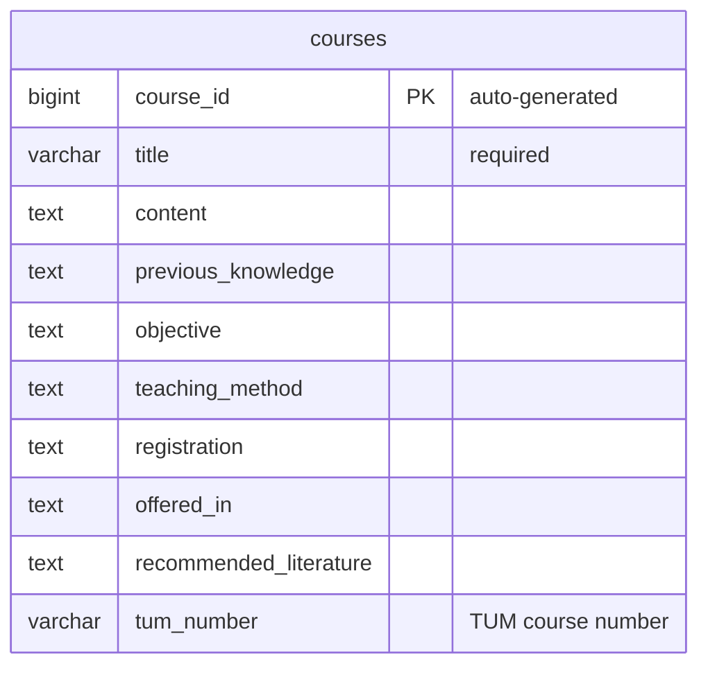
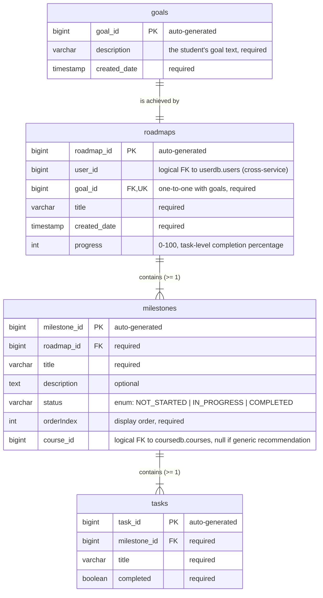

# Database Schema

Each Spring Boot service owns its own PostgreSQL database — services never read
each other's tables; they only talk over REST. The three databases (`userdb`,
`coursedb`, `roadmapdb`) live on one PostgreSQL instance, created by
`server/init-databases.sql` (Docker Compose) or the postgres init scripts in the
Helm chart (Kubernetes). Table schemas are auto-created by Hibernate/JPA from the
entity classes referenced below.

> The llm-service intentionally has **no database**: its per-user monthly token
> usage is kept in memory and resets on restart and at the start of each month.
> The auth event log in user-service is likewise in-memory (recent events only).

## userdb (owned by user-service)

Entities: `server/user-service/src/main/java/com/tum/user/model/`

`feature_flags` and `app_settings` are standalone tables (no relations): runtime
toggles and settings editable from the admin panel without a redeploy. Defaults
are seeded on startup by `FeatureFlagBootstrap` / `SettingBootstrap`; an admin
account is optionally bootstrapped from `ADMIN_EMAIL`/`ADMIN_PASSWORD`.

## coursedb (owned by course-service)

Entity: `server/course-service/src/main/java/com/tum/course/model/Course.java`

Populated by the course seeder
(`server/course-service/fetch_and_seed_courses.py`, run as a Kubernetes job or
compose service), which writes to `coursedb` directly. This is the source of
truth for TUM courses; the llm-service fetches the catalogue over REST when
generating recommendations.

## roadmapdb (owned by roadmap-service)

Entities: `server/roadmap-service/src/main/java/com/tum/roadmap/model/`

Invariants enforced in the entities (`@PrePersist`/`@PreUpdate`): a roadmap must
have at least one milestone, and a milestone at least one task. Milestone status
and roadmap progress are derived from task completion.

## Cross-service references

Two columns reference rows in *another* service's database. They are plain
`bigint` columns, not SQL foreign keys — referential integrity across databases
is handled at the application level via REST:

| Column | Points to | Resolved via |
|---|---|---|
| `roadmaps.user_id` | `userdb.users.user_id` | roadmap-service calls user-service `GET /users/{id}`; the id itself comes from the gateway-verified JWT (`X-User-Id` header) |
| `milestones.course_id` | `coursedb.courses.course_id` | set when a milestone is a TUM course recommendation (traceability); null for generic recommendations |
